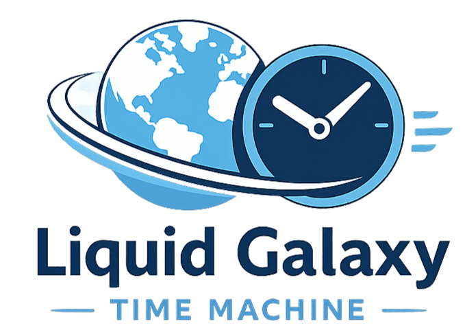

  

# Liquid Galaxy Time Machine

## About Liquid Galaxy Time Machine
Liquid Galaxy Time Machine is an interactive application designed to visualize the evolution of historical landmarks over time. Using the power of Liquid Galaxy, users can travel through past, present, and future eras, exploring how architecture and landscapes have transformed through immersive 3D visualizations and historical data.

## App Features
- **Time Travel Visualization:** Experience Points of Interest (POIs) in Past, Present, and Future eras on a Liquid Galaxy system.
- **Interactive Timeline:** Browse countries and explore their most famous landmarks.
- **AI-Powered Future Estimation:** Generate unique images and facts about what landmarks might look like in the year 2100 using state-of-the-art AI.
- **Dynamic Comparisons:** Compare past or future eras with the present side-by-side on the Liquid Galaxy screens.
- **AI Narration:** Listen to AI-generated descriptions and facts about the locations.
- **Immersive Orbits:** Automatically fly around landmarks for a complete 3D perspective.
- **Liquid Galaxy Management:** Remote control tools for the LG system, including reboot, shutdown, relaunch, and KML/Logo management.
- **Multi-language Support:** Available in English, Spanish, and Catalan.

## Requirements
- **Liquid Galaxy System:** A cluster of screens running the Liquid Galaxy software.
- **Controller Device:** An Android or iOS device to run this application.
- **Network Connectivity:** The device must be on the same network as the Liquid Galaxy system to communicate via SSH.
- **SSH Access:** Valid credentials (IP, Port, Username, and Password) for the Liquid Galaxy master.
- **API Key:** A valid API key from Pollinations.ai is required for AI future estimations.

## How to setup AI API
To enable future estimations, you need to configure an API key to generate the images that will be displayed in the Liquid Galaxy:
1. Visit [pollinations.ai](https://pollinations.ai/).

2. Register and log in with your account.

3. In the Pollinations side menu, go to the **Docs** section and click on **API**.

4. Click **"Get your API Key"** and copy the generated key.

5. Open the Liquid Galaxy Time Machine app and navigate to the **Settings** tab.

6. Paste your key into the **"IMAGE GENERATION API"** field.

7. Click **SAVE**.

## How to use models
You can customize the AI behavior by changing the model:
1. Go to the **Models** section on [pollinations.ai](https://pollinations.ai/) with your account logged in    .

2. Browse the available models (e.g., `sana`, `flux`, `openai`, etc.). Note that some models may have usage limits.

4. Copy the specific model identifier code.

4. In the app's **Settings**, paste the identifier into the **"MODEL"** field.

5. Click **SAVE**.

6. When viewing a POI, select the **Future** era and tap **"GENERATE FUTURE ESTIMATION"**. The app will use your chosen model to envision the landmark in 2100.

## License
Liquid Galaxy Time Machine is licensed under the [MIT License](https://opensource.org/license/MIT)
